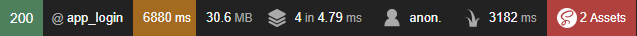
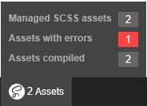
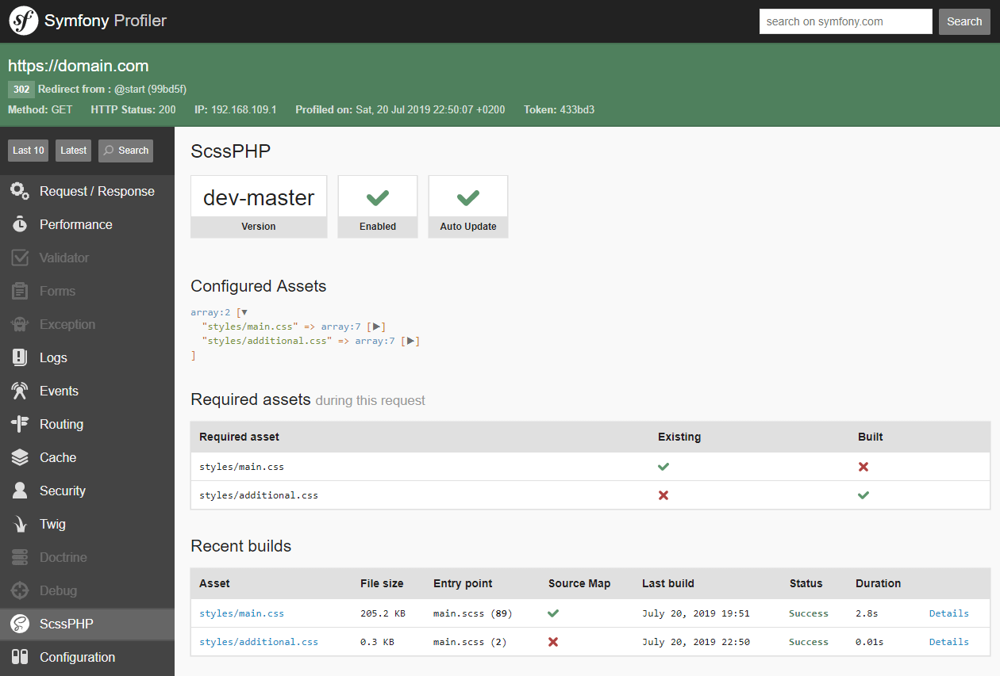
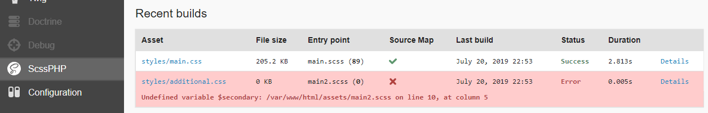
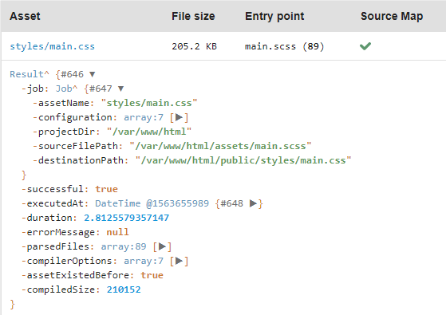
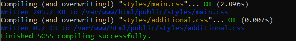

# ScssPHP - Symfony Bundle

This bundle for Symfony Framework (4-6), includes the [scssphp/scssphp](https://github.com/scssphp/scssphp) 
package, which allows you to parse SCSS sources (like Bootstrap) in your application, without need
of Node.js and npm!

The ScssPHP bundle can recognize changes in SCSS source files (or Symfony configuration) automatically
and only re-compiles those files. So, when you change something in your SCSS sources and refresh the application 
you see the results, instantly. You can disable this for the production environment.

Also, it provides a helpful debugger toolbar entry and a command which allows you to compile the SCSS sources 
from CLI.

It is released under MIT license.


## Features

- Compile SCSS sources (like the [Bootstrap](https://getbootstrap.com/) framework) **with pure PHP** (thanks to [scssphp/scssphp](https://github.com/scssphp/scssphp))
- Simple but powerful asset configuration (e.g. set variable values)
- Several output-formatter available (nested, compressed, crushed, etc.)
- Inline source map support
- Profiler Toolbar Debugging
- Symfony Command to compile SCSS sources on CLI
- Auto-update, when sources (or configuration) changes


## Screenshots

**ScssPHP in Symfony's profiler toolbar:**



**Hovering over ScssPHP profiler toolbar entry:**



**ScssPHP profiler panel:**



**Display of SCSS compiling errors:**



**Details of recent SCSS builds:**



**CLI command (with compiling error)**

`$ php bin/console scssphp:compile`

")

**Non-interactive CLI command**

`$ php bin/console scssphp:compile all -n`




## Installation

To install the scssphp-bundle you can just use composer:

```
$ composer require armin/scssphp-bundle
``` 

The bundle also ships a [Symfony Flex Recipe](https://github.com/symfony/recipes-contrib/tree/master/armin/scssphp-bundle/1.0).


## Usage and configuration

The scssphp bundle is triggered, when you use the `{{ asset("...") }}` function in your Twig templates,
and the requested asset is configured in `scssphp.assets` and `scssphp.enabled` is `true`.

**Example asset call in twig:**

```html
<link href="{{ asset('css/styles.css') }}" rel="stylesheet">
```

### Example configuration

For this example you also need to require the Bootstrap CSS framework:

```bash
$ composer require twbs/bootstrap:"^5.0"
```

```yaml
# config/packages/scssphp.yaml
scssphp:
    enabled: true
    assets:
        "css/styles.css":
            src: "assets/main.scss"
            sourceMap: true
            importPaths:
                - "vendor/twbs/bootstrap/scss"
            variables:
                primary: '#ff0066'
```

### Reference

```yaml
# On CLI: php bin/console config:dump scssphp

# Default configuration for extension with alias: "scssphp"
scssphp:

    # When disabled, ScssPHP will not compile SCSS sources automatically, 
    # by user's request. Compiling with CLI tool will still work.
    enabled:              true

    # Automatically re-compile SCSS sources on updates, when enabled.
    autoUpdate:           true

    # List of SCSS assets, which should be compiled, when requested. Key is the asset name/path.
    assets:
        -
            # Path to SCSS source file (entrypoint), relative to Symfony's project directory.
            src:                  ~ # Required

            # Prepends this outputFolder to asset's destination path.
            outputFolder:         public

            # Array of import paths, relative to Symfony's project directory.
            importPaths:          []

            # Array of scss variables, which should be used during compilation. Use key => value here.
            variables:            []

            # Expanded or compressed CSS output.
            outputStyle:          compressed
            # One of: 
            # - "expanded"
            # - "compressed"

            # When enabled, the CSS file contains inline sourceMap comments.
            sourceMap:            false

            # When enabled, the timestamp of the asset, will be appended as query string.
            appendTimestamp:      true
```

## Upgrade notice

Since version 2.0 the option "formatter" has been replaced by "outputStyle",
which may have got values "expanded" or "compressed" (default).


## Support

If you like this Symfony bundle, you can [donate some funds](https://www.paypal.com/cgi-bin/webscr?cmd=_s-xclick&hosted_button_id=2DCCULSKFRZFU)
to support further development. Thank you!

For help please visit the [issue section](https://github.com/a-r-m-i-n/scssphp-bundle/issues) on Github. 
